# Azure Active Directory Terms of use feature
Azure AD Terms of use provides a simple method that organizations can use to present information to end users. This presentation ensures users see relevant disclaimers for legal or compliance requirements. This article describes how to get started with Terms of use.

[!INCLUDE [GDPR-related guidance](../../../includes/gdpr-intro-sentence.md)]

## Overview videos

The following video provides a quick overview of Terms of use.

>[!VIDEO https://www.youtube.com/embed/tj-LK0abNao]

For additional videos, see:
- [How to deploy Terms of use in Azure Active Directory](https://www.youtube.com/embed/N4vgqHO2tgY)
- [How to roll out Terms of use in Azure Active Directory](https://www.youtube.com/embed/t_hA4y9luCY)

## What can I do with Terms of use?
Azure AD Terms of use has the following capabilities:
- Require employees or guests to accept your Terms of use before getting access.
- Require employees or guests to accept your Terms of use on every device before getting access.
- Require employees or guests to accept your Terms of use on a recurring schedule.
- Present general Terms of use for all users in your organization.
- Present specific Terms of use based on a user attributes (ex. doctors vs nurses or domestic vs international employees, by using [dynamic groups](../users-groups-roles/groups-dynamic-membership.md)).
- Present specific Terms of use when accessing high business impact applications, like Salesforce.
- Present Terms of use in different languages.
- List who has or hasn't accepted to your Terms of use.
- Assist in meeting privacy regulations.
- Display a log of Terms of use activity for compliance and audit.
- Create and manage Terms of use using [Microsoft Graph APIs](https://developer.microsoft.com/graph/docs/api-reference/beta/resources/agreement) (currently in preview).

## Prerequisites
To use and configure Azure AD Terms of use, you must have:

- Azure AD Premium P1, P2, EMS E3, or EMS E5 subscription.
    - If you don't have one of theses subscriptions, you can [get Azure AD Premium](../fundamentals/active-directory-get-started-premium.md) or [enable Azure AD Premium trial](https://azure.microsoft.com/trial/get-started-active-directory/).
- One of the following administrator accounts for the directory you want to configure:
    - Global Administrator
    - Security Administrator
    - Conditional Access Administrator

## Terms of use document

Azure AD Terms of use uses the PDF format to present content. The PDF file can be any content, such as existing contract documents, allowing you to collect end-user agreements during user sign-in. To support users on mobile devices, the recommended font size in the PDF is 24 point.

## Add Terms of use
Once you have finalized your Terms of use document, use the following procedure to add it.

1. Sign in to Azure as a Global Administrator, Security Administrator, or Conditional Access Administrator.

1. Navigate to **Terms of use** at [https://aka.ms/catou](https://aka.ms/catou).

    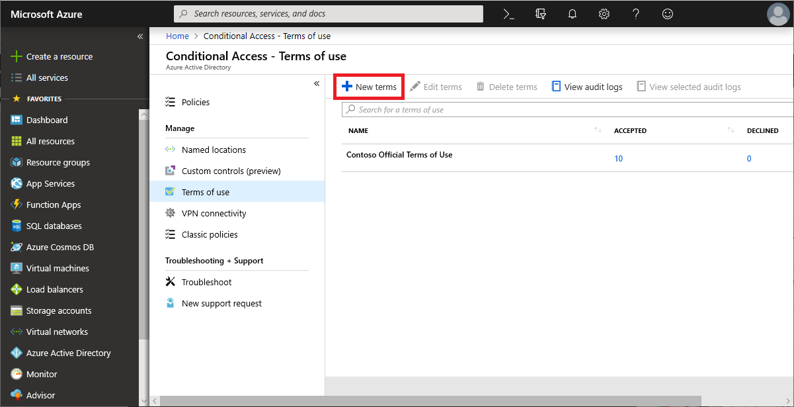

1. Click **New terms**.

    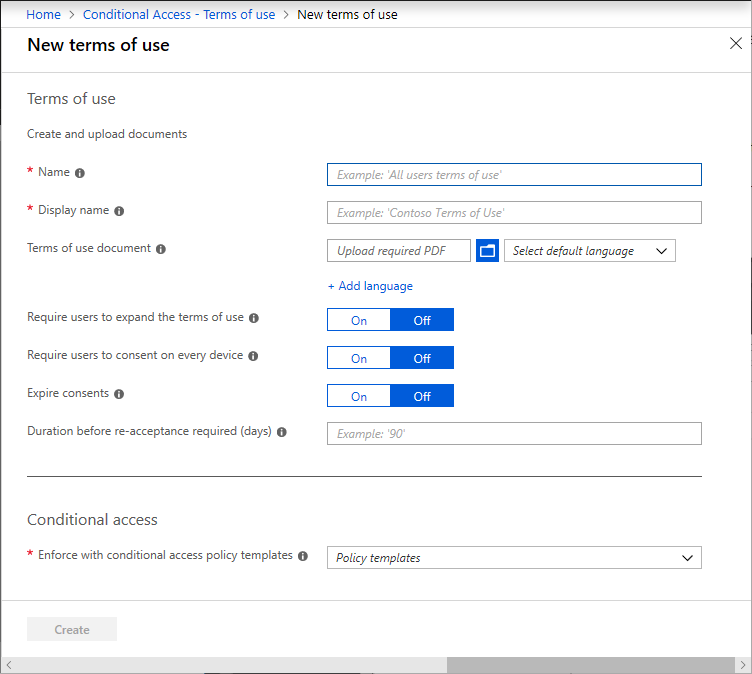

1. In the **Name** box, enter a name for the Terms of use that will be used in the Azure portal.

1. In the **Display name** box, enter a title that users see when they sign in.

1. For **Terms of use document**, browse to your finalized Terms of use PDF and select it.

1. Select the language for your Terms of use document. The language option allows you to upload multiple Terms of use, each with a different language. The version of the Terms of use that an end user will see will be based on their browser preferences.

1. To require end users to view the Terms of use prior to accepting them, set **Require users to expand the terms of use** to **On**.

1. To require end users to accept your Terms of use on every device they are accessing from, set **Require users to consent on every device** to **On**. For more information, see [Per-device Terms of use](#per-device-terms-of-use).

1. If you want to expire Terms of use consents on a schedule, set **Expire consents** to **On**. When set to On, two additional schedule settings are displayed.

    

1. Use the **Expire starting on** and **Frequency** settings to specify the schedule for Terms of use expirations. The following table shows the result for a couple of example settings:

    | Expire starting on | Frequency | Result |
    | --- | --- | --- |
    | Today's date  | Monthly | Starting today, users must accept the Terms of use and then reaccept every month. |
    | Date in the future  | Monthly | Starting today, users must accept the Terms of use. When the future date occurs, consents will expire and then users must reaccept every month.  |

    For example, if you set the expire starting on date to **Jan 1** and frequency to **Monthly**, here is how expirations might occur for two users:

    | User | First accept date | First expire date | Second expire date | Third expire date |
    | --- | --- | --- | --- | --- |
    | Alice | Jan 1 | Feb 1 | Mar 1 | Apr 1 |
    | Bob | Jan 15 | Feb 1 | Mar 1 | Apr 1 |

1. Use the **Duration before re-acceptance requires (days)** setting to specify the number of days before the user must reaccept the Terms of use. This allows users to follow their own schedule. For example, if you set the duration to **30** days, here is how expirations might occur for two users:

    | User | First accept date | First expire date | Second expire date | Third expire date |
    | --- | --- | --- | --- | --- |
    | Alice | Jan 1 | Jan 31 | Mar 2 | Apr 1 |
    | Bob | Jan 15 | Feb 14 | Mar 16 | Apr 15 |

    It is possible to use the **Expire consents** and **Duration before re-acceptance requires (days)** settings together, but typically you use one or the other.

1. Under **Conditional Access**, use the **Enforce with conditional access policy template** list to select the template to enforce the Terms of use.

    

    | Template | Description |
    | --- | --- |
    | **Access to cloud apps for all guests** | A conditional access policy will be created for all guests and all cloud apps. This policy impacts the Azure portal. Once this is created, you might be required to sign-out and sign-in. |
    | **Access to cloud apps for all users** | A conditional access policy will be created for all users and all cloud apps. This policy impacts the Azure portal. Once this is created, you will be required to sign-out and sign-in. |
    | **Custom policy** | Select the users, groups, and apps that this Terms of Use will be applied to. |
    | **Create conditional access policy later** | This terms of use will appear in the grant control list when creating a conditional access policy. |

    >[!IMPORTANT]
    >Conditional access policy controls (including Terms of use) do not support enforcement on service accounts. We recommend excluding all service accounts from the conditional access policy.

     Custom conditional access policies enable granular Terms of use, down to a specific cloud application or group of users. For more information, see [Quickstart: Require terms of use to be accepted before accessing cloud apps](require-tou.md).

1. Click **Create**.

    If you selected a custom conditional access template, then a new screen appears that allows you to create the custom conditional access policy.

    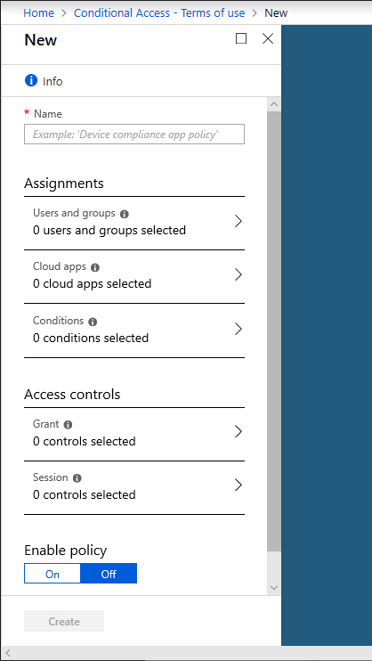

    You should now see your new Terms of use.

    

## View report of who has accepted and declined
The Terms of use blade shows a count of the users who have accepted and declined. These counts and who accepted/declined are stored for the life of the Terms of use.

1. Sign in to Azure and navigate to **Terms of use** at [https://aka.ms/catou](https://aka.ms/catou).

    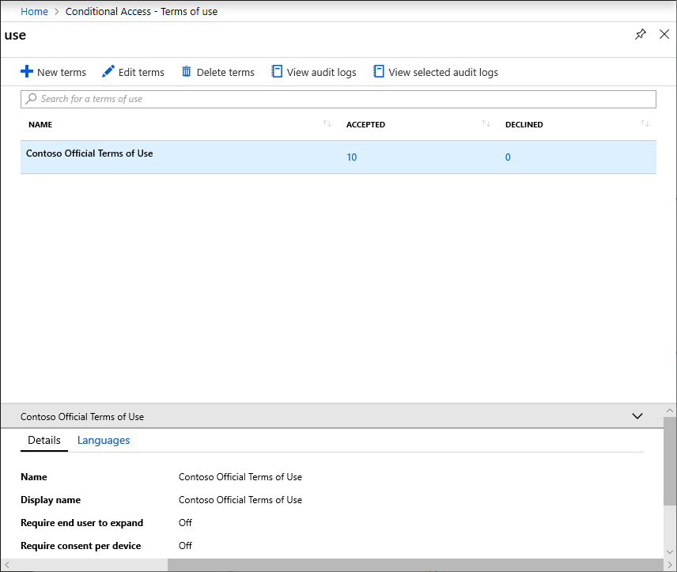

1. For a Terms of use, click the numbers under **Accepted** or **Declined** to view the current state for users.

    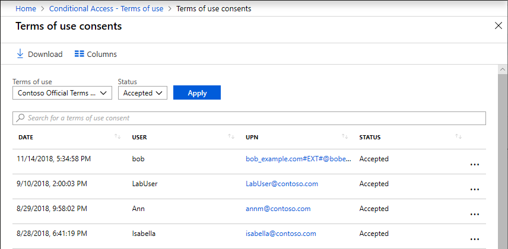

1. To view the history for an individual user, click the ellipsis (**...**) and then **View History**.

    

    In the view history pane, you see a history of all the accepts, declines, and expirations.

    

## View Azure AD audit logs
If you want to view additional activity, Azure AD Terms of use includes audit logs. Each user consent triggers an event in the audit logs that is stored for **30 days**. You can view these logs in the portal or download as a .csv file.

To get started with Azure AD audit logs, use the following procedure:

1. Sign in to Azure and navigate to **Terms of use** at [https://aka.ms/catou](https://aka.ms/catou).

1. Select a Terms of use.

1. Click **View audit logs**.

    

1. On the Azure AD audit logs screen, you can filter the information using the provided lists to target specific audit log information.

    You can also click **Download** to download the information in a .csv file for use locally.

    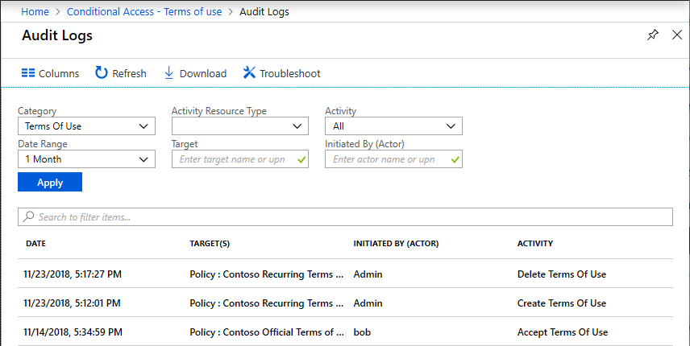

    If you click a log, a pane appears with additional activity details.

    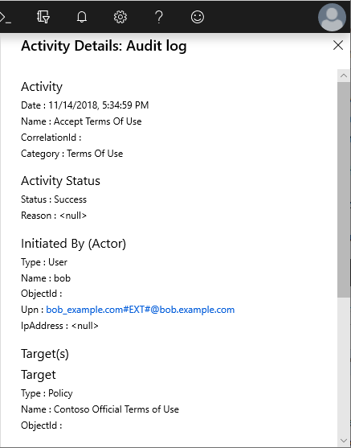

## What Terms of use looks like for users
Once a Terms of use is created and enforced, users, who are in scope, will see the following screen during sign-in.

Users can view the Terms of use and, if necessary, use buttons to zoom in and out.

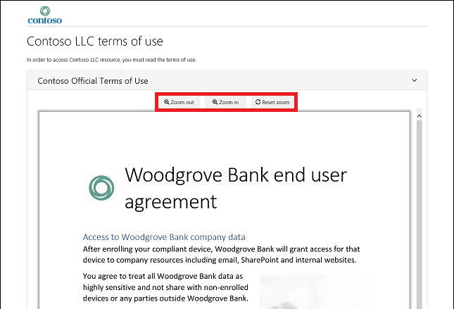

The following screen shows how Terms of use looks on mobile devices.

Users are only required to accept the Terms of use once and they will not see the Terms of use again on subsequent sign-ins.

### How users can review their Terms of use
Users can review and see the Terms of use that they have accepted by using the following procedure.

1. Sign in to [https://myapps.microsoft.com](https://myapps.microsoft.com).

1. In the upper right corner, click your name and select **Profile**.

    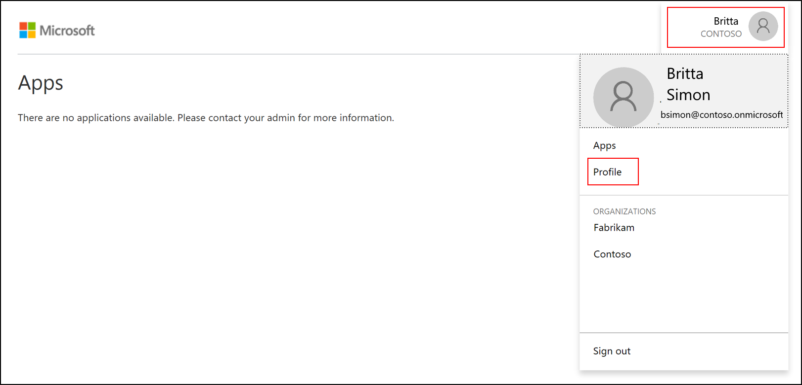

1. On your Profile page, click **Review terms of use**.

    

1. From there, you can review the Terms of use you have accepted.

## Edit Terms of use details
You can edit some details of Terms of use, but you can't modify an existing document. The following procedure describes how to edit the details.

1. Sign in to Azure and navigate to **Terms of use** at [https://aka.ms/catou](https://aka.ms/catou).

1. Select the Terms of use you want to edit.

1. Click **Edit terms**.

1. In the Edit terms of use pane, change the name, display name, or require users to expand values.

    If there are other settings you would like to change, such as PDF document, require users to consent on every device, expire consents, duration before reacceptance, or conditional access policy, you must create a new Terms of use.

    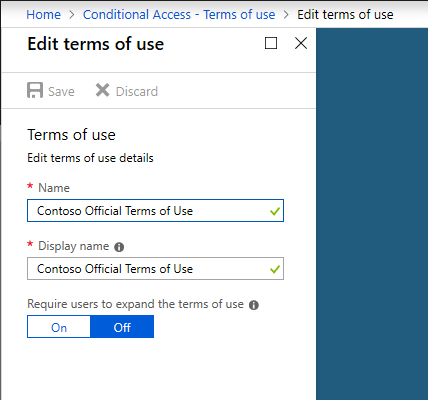

1. Click **Save** to save your changes.

    Once you save your changes, users will not have to reaccept these edits.

## Add a Terms of use language
The following procedure describes how to add a Terms of use language.

1. Sign in to Azure and navigate to **Terms of use** at [https://aka.ms/catou](https://aka.ms/catou).

1. Select the Terms of use you want to edit.

1. In the details pane, click the **Languages** tab.

    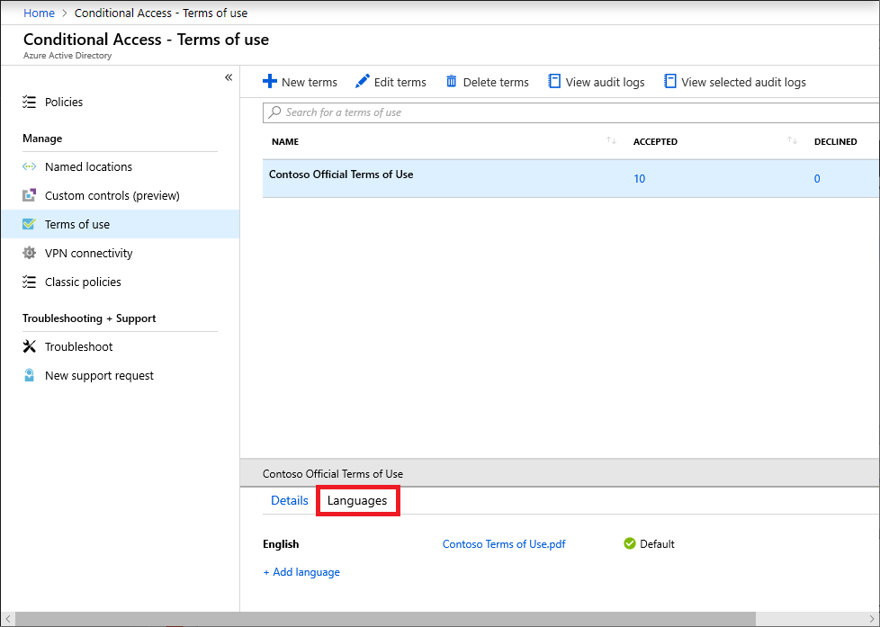

1. Click **Add language**.

1. In the Add terms of use language pane, upload your localized PDF and select the language.

    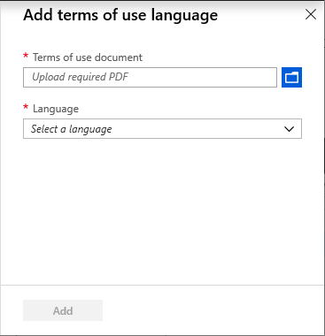

1. Click **Add** to add the language.

## Per-device Terms of use

The **Require users to consent on every device** setting enables you to require end users to accept your Terms of use on every device they are accessing from. The end user will be required to join their device in Azure AD. When the device is joined, the device ID is used to enforce the Terms of use on each device.

Here is a list of the supported platforms and software.

> [!div class="mx-tableFixed"]
> |  | iOS | Android | Windows 10 | Other |
> | --- | --- | --- | --- | --- |
> | **Native app** | Yes | Yes | Yes |  |
> | **Microsoft Edge** | Yes | Yes | Yes |  |
> | **Internet Explorer** | Yes | Yes | Yes |  |
> | **Chrome (with extension)** | Yes | Yes | Yes |  |

Per-device Terms of use has the following constraints:

- A device can only be joined to one tenant.
- A user must have permissions to join their device.
- The Intune Enrollment app is not supported.
- Azure AD B2B users are not supported.

If the user's device is not joined, they will receive a message that they need to join their device. Their experience will be dependent on the platform and software.

### Join a Windows 10 device

If a user is using Windows 10 and Microsoft Edge, they will receive a message similar to the following to [join their device](../user-help/user-help-join-device-on-network.md#to-join-an-already-configured-windows-10-device).

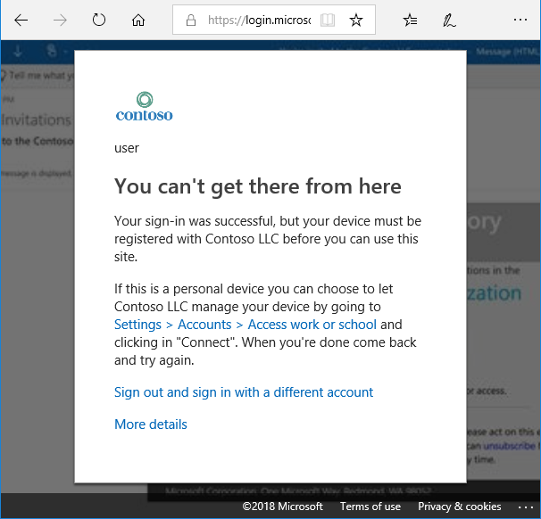

If they are using Chrome, they will be prompted to install the [Windows 10 Accounts extension](https://chrome.google.com/webstore/detail/windows-10-accounts/ppnbnpeolgkicgegkbkbjmhlideopiji).

### Browsers

If a user is using browser that is not supported, they will be asked to use a different browser.

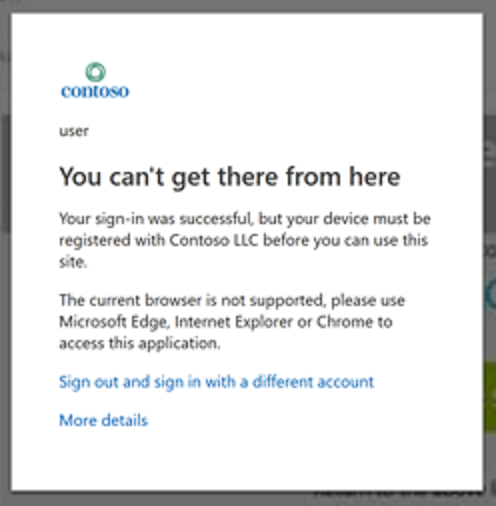

## Delete Terms of use
You can delete old Terms of use using the following procedure.

1. Sign in to Azure and navigate to **Terms of use** at [https://aka.ms/catou](https://aka.ms/catou).

1. Select the Terms of use you want to remove.

1. Click **Delete terms**.

1. In the message that appears asking if you want to continue, click **Yes**.

    

    You should no longer see your Terms of use.

## Deleted users and active Terms of use
By default, a deleted user is in a deleted state in Azure AD for 30 days, during which time they can be restored by an administrator if necessary. After 30 days, that user is permanently deleted. In addition, using the Azure Active Directory portal, a Global Administrator can explicitly [permanently delete a recently deleted user](../fundamentals/active-directory-users-restore.md) before that time period is reached. One a user has been permanently deleted, subsequent data about that user will be removed from the active Terms of use. Audit information about deleted users remains in the audit log.

## Policy changes
Conditional access policies take effect immediately. When this happens, the administrator will start to see “sad clouds” or "Azure AD token issues". The administrator must sign out and sign in again in order to satisfy the new policy.

>[!IMPORTANT]
> Users in scope will need to sign-out and sign-in in order to satisfy a new policy if:
> - a conditional access policy is enabled on a Terms of use
> - or a second Terms of use is created

## B2B guests (Preview)

Most organizations have a process in place for their employees to consent to their organization's Terms of use and privacy statements. But how can you enforce the same consents for Azure AD business-to-business (B2B) guests when they're added via SharePoint or Teams? Using conditional access and Terms of use, you can enforce a policy directly towards B2B guest users. During the invitation redemption flow, the user is presented with the Terms of use. This support is currently in preview.

Terms of use will only be displayed when the user has a guest account in Azure AD. SharePoint Online currently has an [ad hoc external sharing recipient experience](/sharepoint/what-s-new-in-sharing-in-targeted-release) to share a document or a folder that does not require the user to have a guest account. In this case, a Terms of use is not displayed.

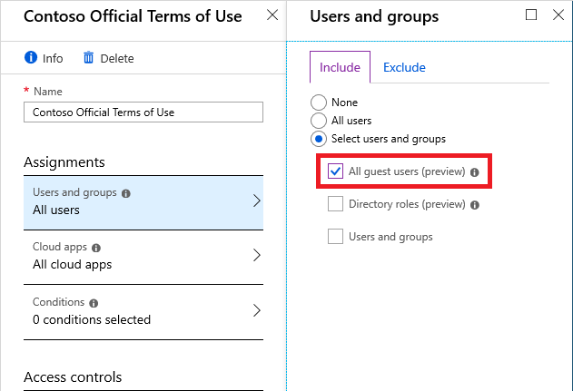

## Support for cloud apps (Preview)

Terms of use can be used for different cloud apps, such as Azure Information Protection and Microsoft Intune. This support is currently in preview.

### Azure Information Protection

You can configure a conditional access policy for the Azure Information Protection app and require a Terms of use when a user accesses a protected document. This will trigger a Terms of use prior to a user accessing a protected document for the first time.

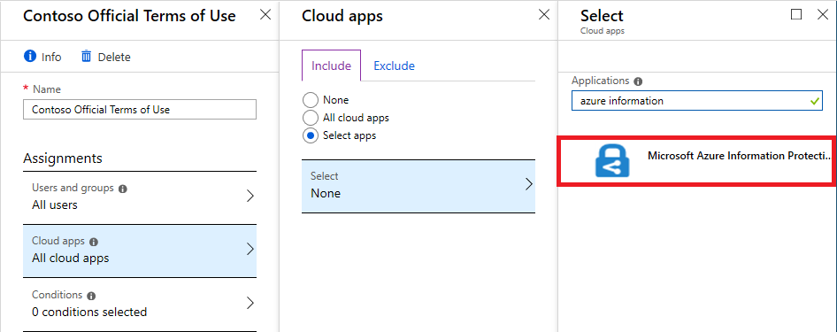

### Microsoft Intune Enrollment

You can configure a conditional access policy for the Microsoft Intune Enrollment app and require a Terms of use prior to the enrollment of a device in Intune. For more information, see the Read [Choosing the right Terms solution for your organization blog post](https://go.microsoft.com/fwlink/?linkid=2010506&clcid=0x409).

> [!NOTE]
> The Intune Enrollment app is not supported for [Per-device Terms of use](#per-device-terms-of-use).

## Frequently asked questions

**Q: How do I see when/if a user has accepted a Terms of use?** 
A: On the Terms of use blade, click the number under **Accepted**. You can also view or search the accept activity in the Azure AD audit logs. For more information, see View report of who has accepted and declined and [View Azure AD audit logs](#view-azure-ad-audit-logs).

**Q: How long is information stored?** 
A: The user counts in the Terms of use report and who accepted/declined are stored for the life of the Terms of use. The Azure AD audit logs are stored for 30 days.

**Q: Why do I see a different number of consents in the Terms of use report vs. the Azure AD audit logs?** 
A: The Terms of use report is stored for the lifetime of that Terms of use, while the Azure AD audit logs are stored for 30 days. Also, the Terms of use report only displays the users current consent state. For example, if a user declines and then accepts, the Terms of use report will only show that user's accept. If you need to see the history, you can use the Azure AD audit logs.

**Q: If I edit the details for a Terms of use, does it require users to accept again?** 
A: No, if an administrator edits the details for a Terms of use (name, display name, require users to expand, or add a language), it does not require users to reaccept the new terms.

**Q: Can I update an existing Terms of use document?** 
A: Currently, you can't update an existing Terms of use document. To change a Terms of use document, you will have to create a new Terms of use instance.

**Q: If hyperlinks are in the Terms of use PDF document, will end users be able to click them?** 
A: The PDF is rendered by default as a JPEG, so hyperlinks are not clickable. Users have the option to select **Having trouble viewing? Click here**, which renders the PDF natively where hyperlinks are supported.

**Q: Can a Terms of use support multiple languages?** 
A: Yes. Currently there are 108 different languages an administrator can configure for a single Terms of use. An administrator can upload multiple PDF documents and tag those documents with a corresponding language (up to 108). When end users sign in, we look at their browser language preference and display the matching document. If there is no match, we will display the default document, which is the first document that is uploaded.

**Q: When is the Terms of use triggered?** 
A: The Terms of use is triggered during the sign-in experience.

**Q: What applications can I target a Terms of use to?** 
A: You can create a conditional access policy on the enterprise applications using modern authentication. For more information, see [enterprise applications](./../manage-apps/view-applications-portal.md).

**Q: Can I add multiple Terms of use to a given user or app?** 
A: Yes, by creating multiple conditional access policies targeting those groups or applications. If a user falls in scope of multiple Terms of use, they accept one Terms of use at a time.

**Q: What happens if a user declines the Terms of use?** 
A: The user is blocked from getting access to the application. The user would have to sign in again and accept the terms in order to get access.

**Q: Is it possible to unaccept Terms of use that were previously accepted?** 
A: You can [review previously accepted Terms of use](#how-users-can-review-their-terms-of-use), but currently there isn't a way to unaccept.

**Q: What happens if I'm also using Intune terms and conditions?** 
A: If you have configured both Azure AD Terms of use and [Intune terms and conditions](/intune/terms-and-conditions-create), the user will be required to accept both. For more information, see the [Choosing the right Terms solution for your organization blog post](https://go.microsoft.com/fwlink/?linkid=2010506&clcid=0x409).

**Q: What endpoints does the Terms of use service use for authentication?** 
A: Terms of use utilizes the following endpoints for authentication: https://tokenprovider.termsofuse.identitygovernance.azure.com and https://account.activedirectory.windowsazure.com. If your organization has an allow list of URLs for enrollment, you will need to add these endpoints to your allow list, along with the Azure AD endpoints for sign in.

## Next steps

- [Quickstart: Require terms of use to be accepted before accessing cloud apps](require-tou.md)
- [Best practices for conditional access in Azure Active Directory](best-practices.md)
