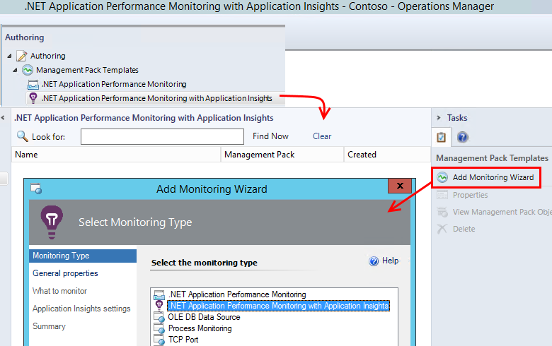
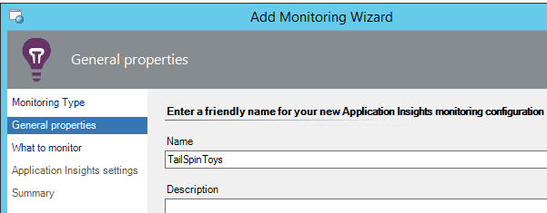
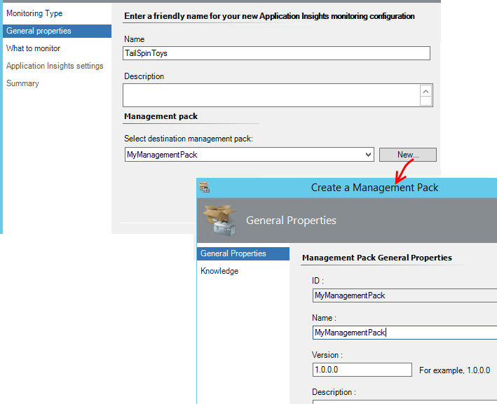
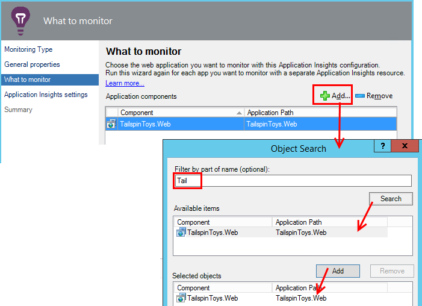
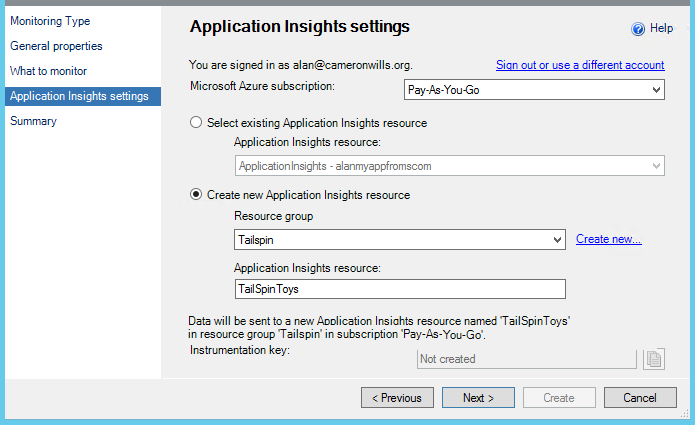
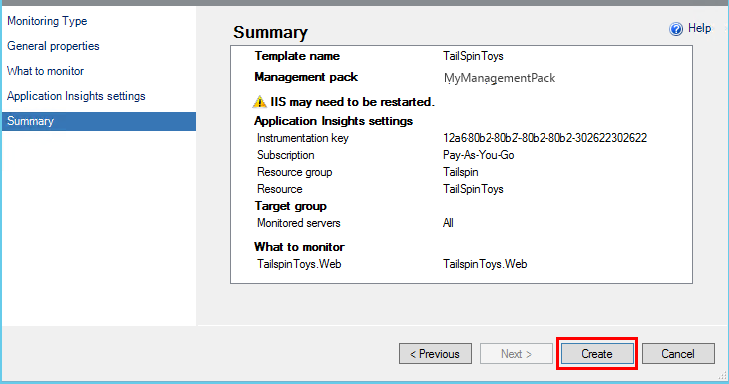

# Application Performance Monitoring using Application Insights for SCOM
If you use System Center Operations Manager (SCOM) to manage your servers, you can monitor performance and diagnose performance issues with the help of [Azure Application Insights](../../azure-monitor/app/asp-net.md). Application Insights monitors your web application's incoming requests, outgoing REST and SQL calls, exceptions, and log traces. It provides dashboards with metric charts and smart alerts, as well as powerful diagnostic search and analytical queries over this telemetry. 

You can switch on Application Insights monitoring by using an SCOM management pack.

> [!IMPORTANT]
> This System Center Operations Manager Management Pack is now **deprecated**. It does not support the latest Application Insights SDKs and is no longer recommended.

## Before you start
We assume:

* You're familiar with SCOM, and that you use SCOM 2012 R2 or 2016 to manage your IIS web servers.
* You have already installed on your servers a web application that you want to monitor with Application Insights.
* App framework version is .NET 4.5 or later.
* You have access to a subscription in [Microsoft Azure](https://azure.com) and can sign in to the [Azure portal](https://portal.azure.com). Your organization may have a subscription, and can add your Microsoft account to it.

(The development team might build the [Application Insights SDK](../../azure-monitor/app/asp-net.md) into the web app. This build-time instrumentation gives them greater flexibility in writing custom telemetry. However, it doesn't matter: you can follow the steps described here either with or without the SDK built in.)

## (One time) Install Application Insights management pack
On the machine where you run Operations Manager:

1. Uninstall any old version of the management pack:
   1. In Operations Manager, open Administration, Management Packs. 
   2. Delete the old version.
2. Download and install the management pack from the catalog.
3. Restart Operations Manager.

## Create a management pack
1. In Operations Manager, open **Authoring**, **.NET...with Application Insights**, **Add Monitoring Wizard**, and again choose **.NET...with Application Insights**.
   
    
2. Name the configuration after your app. (You have to instrument one app at a time.)
   
    
3. On the same wizard page, either create a new management pack, or select a pack that you created for Application Insights earlier.
   
     (The Application Insights [management pack](https://technet.microsoft.com/library/cc974491.aspx) is a template, from which you create an instance. You can reuse the same instance later.)

    

1. Choose one app that you want to monitor. The search feature searches among apps installed on your servers.
   
    
   
    The optional Monitoring scope field can be used to specify a subset of your servers, if you don't want to monitor the app in all servers.
2. On the next wizard page, you must first provide your credentials to sign in to Microsoft Azure.
   
    On this page, you choose the Application Insights resource where you want the telemetry data to be analyzed and displayed. 
   
   * If the application was configured for Application Insights during development, select its existing resource.
   * Otherwise, create a new resource named for the app. If there are other apps that are components of the same system, put them in the same resource group, to make access to the telemetry easier to manage.
     
     You can change these settings later.
     
     
3. Complete the wizard.
   
    

Repeat this procedure for each app that you want to monitor.

If you need to change settings later, re-open the properties of the monitor from the Authoring window.

## Verify monitoring
The monitor that you have installed searches for your app on every server. Where it finds the app, it configures Application Insights Status Monitor to monitor the app. If necessary, it first installs Status Monitor on the server.

You can verify which instances of the app it has found:

## View telemetry in Application Insights
In the [Azure portal](https://portal.azure.com), browse to the resource for your app. You [see charts showing telemetry](../../azure-monitor/app/app-insights-dashboards.md) from your app. (If it hasn't shown up on the main page yet, click Live Metrics Stream.)

## Next steps
* [Set up a dashboard](../../azure-monitor/app/app-insights-dashboards.md) to bring together the most important charts monitoring this and other apps.
* [Learn about metrics](../../azure-monitor/app/metrics-explorer.md)
* [Set up alerts](../../azure-monitor/app/alerts.md)
* [Diagnosing performance issues](../../azure-monitor/app/detect-triage-diagnose.md)
* [Powerful Analytics queries](../../azure-monitor/app/analytics.md)
* [Availability web tests](../../azure-monitor/app/monitor-web-app-availability.md)

