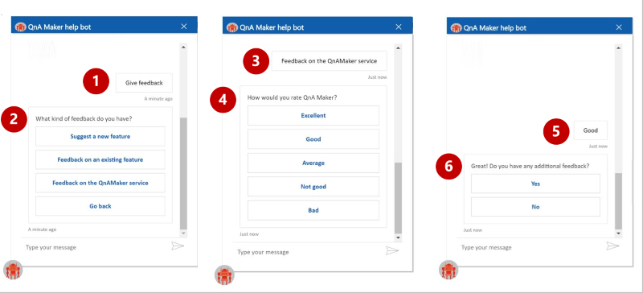
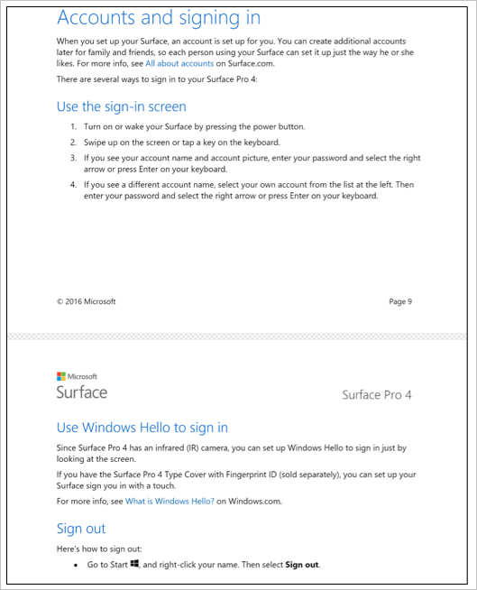
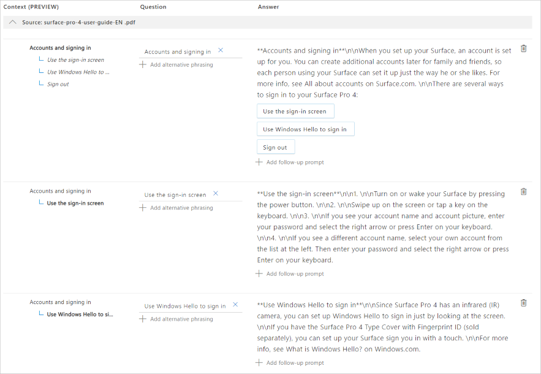
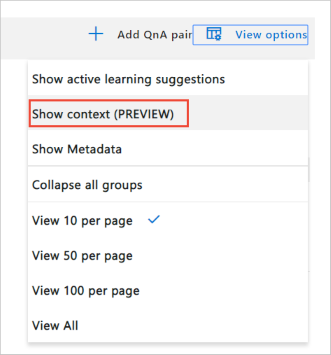
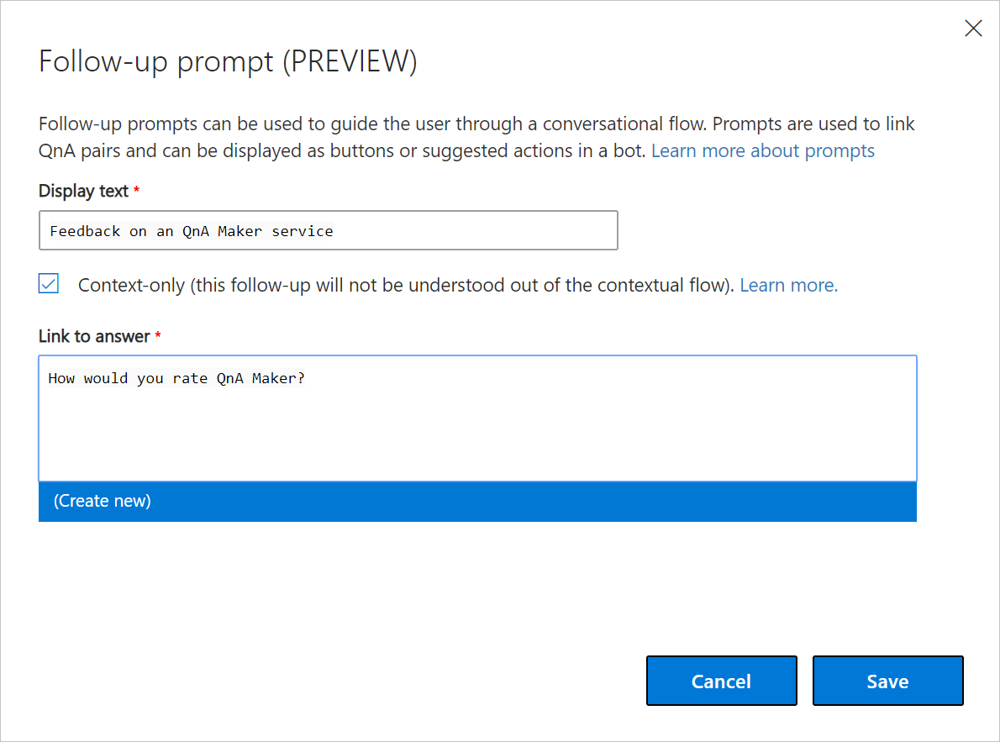
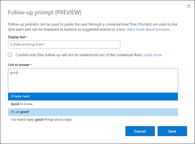
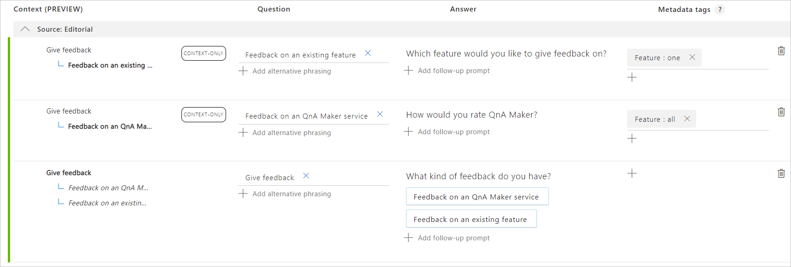
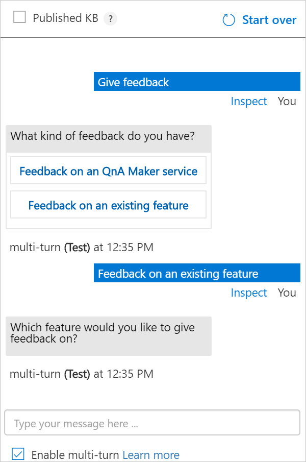

# Use follow-up prompts to create multiple turns of a conversation

Use follow-up prompts and context to manage the multiple turns, known as _multi-turn_, for your bot from one question to another.

Learn from the [demonstration video](https://aka.ms/multiturnexample).

## What is a multi-turn conversation?

Some types of conversation can't be completed in a single turn. When you design your client application (chat bot) conversations, a user may ask a question that needs to be filtered or refined in order to determine the correct answer. This flow through the questions is possible by presenting the user with **follow-up prompts**.

When the user asks the question, QnA Maker returns the answer _and_ any follow-up prompts. This allows you to present the follow-up questions as choices. 

## Example multi-turn conversation with chat bot

A chat bot manages the conversation, question by question, with the user to determine the final answer.



In the preceding image, the user's question needs to be refined before returning the answer. In the knowledge base, the question (#1), has four follow-up prompts, presented in the chat bot as four choices (#2). 

When the user selects a choice (#3), then the next list of refining choices (#4) is presented. This can continue (#5) until the correct and final answer (#6) is determined.

You need to change your client application to manage the contextual conversation.

## Create a multi-turn conversation from document's structure
When you create a knowledge base, you will see an optional check-box to enable multi-turn extraction. If you select this option, when you import a document, the multi-turn conversation can be implied from the structure. If that structure exists, QnA Maker creates the follow-up prompt QnA pairs for you. 
Multi-turn structure can only be inferred from URLs, PDF, or DOCX files. 

The following image of a Microsoft Surface [PDF file](https://github.com/Azure-Samples/cognitive-services-sample-data-files/blob/master/qna-maker/data-source-formats/product-manual.pdf) is meant to be used as a manual. 

](../media/conversational-context/import-file-with-conversational-structure.png#lightbox)

When importing the PDF document, QnA Maker determines follow-up prompts from the structure to create conversational flow. 

](../media/conversational-context/surface-manual-pdf-follow-up-prompt.png#lightbox)

## Show questions and answers with context

1. Reduce the question and answer pairs displayed to just those with contextual conversations. Select **View options**, then select **Show context (PREVIEW)**. The list will be empty until you add the first question and answer pair with a follow-up prompt. 

    

## Add new QnA pair as follow-up prompt

1. Select **Add QnA pair**. 
1. Enter the new question text, `Give feedback.` with an answer of `What kind of feedback do you have?`.

1. In the **Answer** column for this question, select **Add follow-up prompt**. 
1. The **Follow-up prompt (PREVIEW)** pop-up window allows you to search for an existing question or enter a new question. Create a new prompt by entering the following values: 

    |Text field|Value|
    |--|--|
    |**Display Text**|`Feedback on an QnA Maker service`|
    |**Link to answer**|`How would you rate QnA Maker??`|
    |||

    

1. Check **Context-only**. The **Context-only** option indicates that this user text will be understood _only_ if given in response to the previous question. For this scenario, the prompt text doesn't make any sense as a stand-alone question, it only makes sense from the context of the previous question.
1. Select **Create new** then select **Save**. 

    This created a new question-and-answer pair and linked the selected question as a follow-up prompt. The **Context** column, for both questions, indicates a follow-up prompt relationship. 

    ](../media/conversational-context/child-prompt-created.png#lightbox)

1. Select **Add follow-up prompt** for the `Give feedback` question to add another follow-up prompt. This opens the **Follow-up prompt (PREVIEW)** pop-up window.

1. Create a new prompt by entering the following values:

    |Text field|Value|
    |--|--|
    |**Display Text**|`Feedback on an existing feature`|
    |**Link to answer**|`Which feature would you like to give feedback on?`|
    |||

1. Check **Context-only**. The **Context-only** option indicates that this user text will be understood _only_ if given in response to the previous question. For this scenario, the prompt text doesn't make any sense as a stand-alone question, it only makes sense from the context of the previous question.

1. Select **Save**. 

    This created a new question and linked the question as a follow-up prompt question to the `Give feedback` question.
    
    At this point, the top question has two follow-up prompts liked to the previous question, `Give feedback`.

    ](../media/conversational-context/all-child-prompts-created.png#lightbox)

1. Select **Save and Train** to train the knowledge base with the new questions. 

## Add existing QnA pair as follow-up prompt

1. If you want to link an existing QnA pair as a follow-up prompt, select the row for the question and answer pair.
1. Select **Add follow-up prompt** in that row.
1. In the **Follow-up prompt (PREVIEW)** pop-up window, enter the answer text in the search box. All matches are returned. Select the answer you want as the follow-up, and check **Context-only**, then select **Save**. 

    

    Once you have added the follow-up prompt, remember to select **Save and train**.
  
<!--

## To find best prompt answer, add metadata to follow-up prompts 

If you have several follow-up prompts for a given QnA pair, but you know as the knowledge base manager, that not all prompts should be returned, use metadata to categorize the prompts in the knowledge base, then send the metadata from the client application as part of the GenerateAnswer request.

In the knowledge base, when a question-and-answer pair is linked to follow-up prompts, the metadata filters are applied first, then the follow-ups are returned.

1. For the two follow-up QnA pairs, add metadata to each one:

    |Question|Add metadata|
    |--|--|
    |`Feedback on an QnA Maker service`|"Feature":"all"|
    |`Feedback on an existing feature`|"Feature":"one"|
    
     

1. Save and train. 

    When you send the question `Give feedback` with the metadata filter `Feature` with a value of `all`, only the QnA pair with that metadata will be returned. Both QnA pairs are not returned because they both do not match the filter. 

-->

## Test the QnA set to get all the follow-up prompts

When testing the question with follow-up prompts in the **Test** pane, select **Enable multi-turn**, and enter your question. The response includes the follow-up prompts.



## JSON request to return initial answer and follow-up prompts

Use the empty `context` object to request the answer to the user's question and include follow-up prompts. 

```JSON
{
  "question": "accounts and signing in",
  "top": 30,
  "userId": "Default",
  "isTest": false,
  "context": {}
}
```

## JSON response to return initial answer and follow-up prompts

The previous section requested an answer and any follow-up prompts to `Accounts and signing in`. The response includes the prompt information, located at `answers[0].context`, include the text to display to the user. 

```JSON
{
    "answers": [
        {
            "questions": [
                "Accounts and signing in"
            ],
            "answer": "**Accounts and signing in**\n\nWhen you set up your Surface, an account is set up for you. You can create additional accounts later for family and friends, so each person using your Surface can set it up just the way they like. For more info, see All about accounts on Surface.com. \n\nThere are several ways to sign in to your Surface Pro 4: ",
            "score": 86.96,
            "id": 37,
            "source": "surface-pro-4-user-guide-EN .pdf",
            "metadata": [],
            "context": {
                "isContextOnly": true,
                "prompts": [
                    {
                        "displayOrder": 0,
                        "qnaId": 38,
                        "qna": null,
                        "displayText": "Use the sign-in screen"
                    },
                    {
                        "displayOrder": 1,
                        "qnaId": 39,
                        "qna": null,
                        "displayText": "Use Windows Hello to sign in"
                    },
                    {
                        "displayOrder": 2,
                        "qnaId": 40,
                        "qna": null,
                        "displayText": "Sign out"
                    }
                ]
            }
        },
        {
            "questions": [
                "Use the sign-in screen"
            ],
            "answer": "**Use the sign-in screen**\n\n1.  \n\nTurn on or wake your Surface by pressing the power button. \n\n2.  \n\nSwipe up on the screen or tap a key on the keyboard. \n\n3.  \n\nIf you see your account name and account picture, enter your password and select the right arrow or press Enter on your keyboard. \n\n4.  \n\nIf you see a different account name, select your own account from the list at the left. Then enter your password and select the right arrow or press Enter on your keyboard. ",
            "score": 32.27,
            "id": 38,
            "source": "surface-pro-4-user-guide-EN .pdf",
            "metadata": [],
            "context": {
                "isContextOnly": true,
                "prompts": []
            }
        },
        {
            "questions": [
                "Sign out"
            ],
            "answer": "**Sign out**\n\nHere's how to sign out: \n\n Go to Start , and right-click your name. Then select Sign out. ",
            "score": 27.0,
            "id": 40,
            "source": "surface-pro-4-user-guide-EN .pdf",
            "metadata": [],
            "context": {
                "isContextOnly": true,
                "prompts": []
            }
        }
    ],
    "debugInfo": null
}
```

The `prompts` array provides text in the `displayText` property and the `qnaId` value so you can show these answers as the next displayed choices in the conversation flow. 

## JSON request to return non-initial answer and follow-up prompts

Fill the `context` object to include previous context.

In the following JSON request, the current question is `Use Windows Hello to sign in` and the previous question was `Accounts and signing in`. 

```JSON
{
  "question": "Use Windows Hello to sign in",
  "top": 30,
  "userId": "Default",
  "isTest": false,
  "qnaId": 39,
  "context": {
    "previousQnAId": 37,
    "previousUserQuery": "accounts and signing in"
  }
}
``` 

##  JSON response to return non-initial answer and follow-up prompts

The QnA Maker _GenerateAnswer_ JSON response includes the follow-up prompts in the `context` property of the first item in the `answers` object:

```JSON
{
    "answers": [
        {
            "questions": [
                "Give feedback"
            ],
            "answer": "What kind of feedback do you have?",
            "score": 100.0,
            "id": 288,
            "source": "Editorial",
            "metadata": [],
            "context": {
                "isContextOnly": true,
                "prompts": [
                    {
                        "displayOrder": 0,
                        "qnaId": 291,
                        "qna": null,
                        "displayText": "Feedback on an QnA Maker service"
                    },
                    {
                        "displayOrder": 0,
                        "qnaId": 292,
                        "qna": null,
                        "displayText": "Feedback on an existing feature"
                    }
                ]
            }
        }
    ]
}
```

## Displaying prompts and sending context in the client application 

If you have added prompts in your knowledge base and have tested the flow in the test pane, the prompts will not automatically start showing up in the client applications. You can show the prompts as suggested actions or buttons as part of the answer to the user’s query in client applications by including this [Bot Framework sample](https://aka.ms/qnamakermultiturnsample) in your code. The client application shall store the current QnA ID and the user query, and pass them in the [context object of the GenerateAnswer API](#json-request-to-return-non-initial-answer-and-follow-up-prompts) for the next user query.

## Display order supported in API

The display order, returned in the JSON response, is supported for editing by the API only. 

## Next steps

Learn more about contextual conversations from the [Dialog sample](https://aka.ms/qnamakermultiturnsample) or learn more [conceptual bot design for multi-turn conversations](https://docs.microsoft.com/azure/bot-service/bot-builder-conversations?view=azure-bot-service-4.0).

> [!div class="nextstepaction"]
> [Migrate a knowledge base](../Tutorials/migrate-knowledge-base.md)
