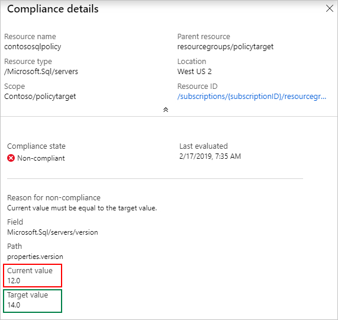
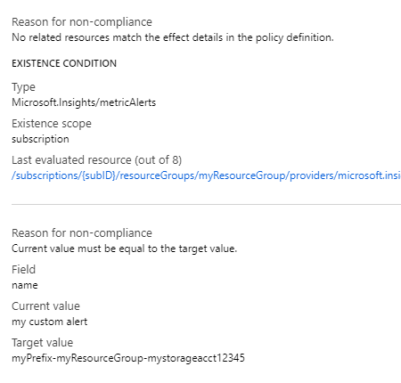
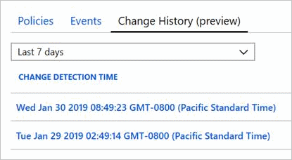
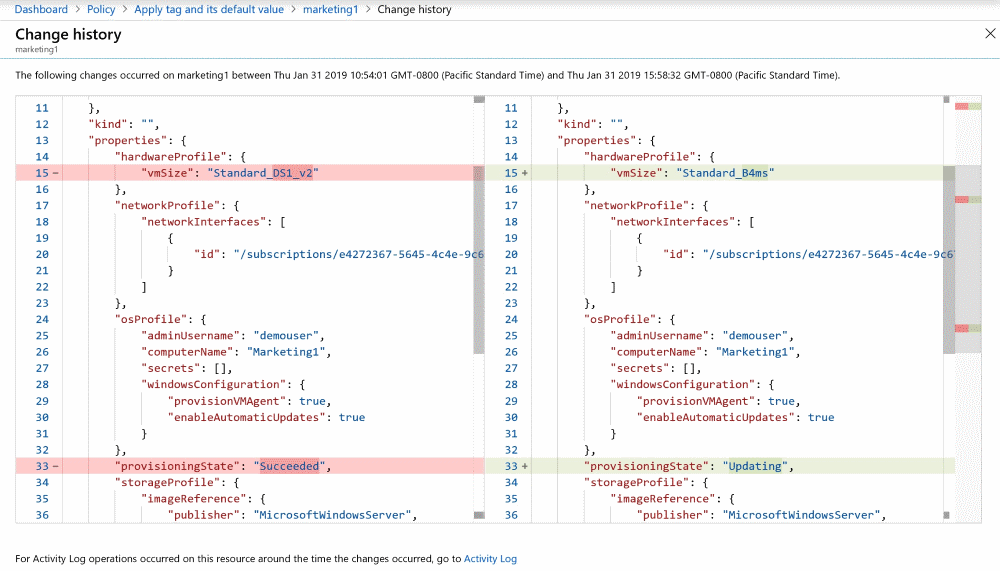

# Determine causes of non-compliance

When an Azure resource is determined to be non-compliant to a policy rule, it's helpful to
understand which portion of the rule the resource isn't compliant with. It's also useful to
understand what change altered a previously compliant resource to make it non-compliant. There are
two ways to find this information:

> [!div class="checklist"]
> - [Compliance details](#compliance-details)
> - [Change history (Preview)](#change-history-preview)

## Compliance details

When a resource is non-compliant, the compliance details for that resource are available from the
**Policy compliance** page. The compliance details pane includes the following information:

- Resource details such as name, type, location, and resource ID
- Compliance state and timestamp of the last evaluation for the current policy assignment
- A list of _reasons_ for the resource non-compliance

> [!IMPORTANT]
> As the compliance details for a _Non-compliant_ resource shows the current value of properties on
> that resource, the user must have **read** operation to the **type** of resource. For example, if
> the _Non-compliant_ resource is **Microsoft.Compute/virtualMachines** then the user must have the
> **Microsoft.Compute/virtualMachines/read** operation. If the user doesn't have the needed
> operation, an access error is displayed.

To view the compliance details, follow these steps:

1. Launch the Azure Policy service in the Azure portal by clicking **All services**, then searching
   for and selecting **Policy**.

1. On the **Overview** or **Compliance** page, select a policy in a **compliance state** that is
   _Non-compliant_.

1. Under the **Resource compliance** tab of the **Policy compliance** page, right-click or select
   the ellipsis of a resource in a **compliance state** that is _Non-compliant_. Then select **View
   compliance details**.

   

1. The **Compliance details** pane displays information from the latest evaluation of the resource
   to the current policy assignment. In this example, the field **Microsoft.Sql/servers/version** is
   found to be _12.0_ while the policy definition expected _14.0_. If the resource is non-compliant
   for multiple reasons, each is listed on this pane.

   

   For an **auditIfNotExists** or **deployIfNotExists** policy definition, the details include the
   **details.type** property and any optional properties. For a list, see [auditIfNotExists
   properties](../concepts/effects.md#auditifnotexists-properties) and [deployIfNotExists
   properties](../concepts/effects.md#deployifnotexists-properties). **Last evaluated resource** is
   a related resource from the **details** section of the definition.

   Example partial **deployIfNotExists** definition:

   ```json
   {
       "if": {
           "field": "type",
           "equals": "[parameters('resourceType')]"
       },
       "then": {
           "effect": "DeployIfNotExists",
           "details": {
               "type": "Microsoft.Insights/metricAlerts",
               "existenceCondition": {
                   "field": "name",
                   "equals": "[concat(parameters('alertNamePrefix'), '-', resourcegroup().name, '-', field('name'))]"
               },
               "existenceScope": "subscription",
               "deployment": {
                   ...
               }
           }
       }
   }
   ```

   

> [!NOTE]
> To protect data, when a property value is a _secret_ the current value displays asterisks.

These details explain why a resource is currently non-compliant, but don't show when the change was
made to the resource that caused it to become non-compliant. For that information, see [Change
history (Preview)](#change-history-preview) below.

### Compliance reasons

The following matrix maps each possible _reason_ to the responsible
[condition](../concepts/definition-structure.md#conditions) in the policy definition:

|Reason | Condition |
|-|-|
|Current value must contain the target value as a key. |containsKey or **not** notContainsKey |
|Current value must contain the target value. |contains or **not** notContains |
|Current value must be equal to the target value. |equals or **not** notEquals |
|Current value must exist. |exists |
|Current value must be in the target value. |in or **not** notIn |
|Current value must be like the target value. |like or **not** notLike |
|Current value must case-sensitive match the target value. |match or **not** notMatch |
|Current value must case-insensitive match the target value. |matchInsensitively or **not** notMatchInsensitively |
|Current value must not contain the target value as a key. |notContainsKey or **not** containsKey|
|Current value must not contain the target value. |notContains or **not** contains |
|Current value must not be equal to the target value. |notEquals or **not** equals |
|Current value must not exist. |**not** exists  |
|Current value must not be in the target value. |notIn or **not** in |
|Current value must not be like the target value. |notLike or **not** like |
|Current value must not case-sensitive match the target value. |notMatch or **not** match |
|Current value must not case-insensitive match the target value. |notMatchInsensitively or **not** matchInsensitively |
|No related resources match the effect details in the policy definition. |A resource of the type defined in **then.details.type** and related to the resource defined in the **if** portion of the policy rule doesn't exist. |

## Compliance details for Guest Configuration

For _audit_ policies in the _Guest Configuration_ category, there could be multiple settings
evaluated inside the VM and you'll need to view per-setting details. For example, if you're auditing
for a list of installed applications and the assignment status is _Non-compliant_, you'll need to
know which specific applications are missing.

You also might not have access to sign in to the VM directly but you need to report on why the VM is
_Non-compliant_. For example, you might audit that VMs are joined to the correct domain and include
the current domain membership in the reporting details.

### Azure portal

1. Launch the Azure Policy service in the Azure portal by clicking **All services**, then searching
   for and selecting **Policy**.

1. On the **Overview** or **Compliance** page, select a policy assignment for any initiative that
   contains a Guest Configuration policy definition that's _Non-compliant_.

1. Select an _audit_ policy in the initiative that's _Non-compliant_.

   

1. On the **Resource compliance** tab, the following information is provided:

   - **Name** - The name of the Guest Configuration Assignments.
   - **Parent Resource** - The virtual machine in a _Non-Compliant_ state for the selected Guest
     Configuration assignment.
   - **Resource Type** - The _guestConfigurationAssignments_ full name.
   - **Last Evaluated** - The last time the Guest Configuration service notified Azure Policy about
     the state of the target virtual machine.

   

1. Select the Guest Configuration Assignment name in the **Name** column to open the **Resource
   Compliance** page.

1. Select the **View Resource** button at the top of the page to open the **Guest Assignment** page.

The **Guest Assignment** page displays all available compliance details. Each row in the view
represents an evaluation that was performed inside the virtual machine. In the **Reason** column, a
phrase describing why the Guest Assignment is _Non-compliant_ is shown. For example, if you're
auditing that VMs should be joined to a domain, the **Reason** column would display text including
the current domain membership.


### Azure PowerShell

You can also view compliance details from Azure PowerShell. First, make sure you have the Guest
Configuration module installed.

```azurepowershell-interactive
Install-Module Az.GuestConfiguration
```

You can view the current status of all Guest Assignments for a VM using the following command:

```azurepowershell-interactive
Get-AzVMGuestPolicyReport -ResourceGroupName <resourcegroupname> -VMName <vmname>
```

```output
PolicyDisplayName                                                         ComplianceReasons
-----------------                                                         -----------------
Audit that an application is installed inside Windows VMs                 {[InstalledApplication]bwhitelistedapp}
Audit that an application is not installed inside Windows VMs.            {[InstalledApplication]NotInstalledApplica...
```

To view only the _reason_ phrase that describes why the VM is _Non-compliant_, return only the
Reason child property.

```azurepowershell-interactive
Get-AzVMGuestPolicyReport -ResourceGroupName <resourcegroupname> -VMName <vmname> | % ComplianceReasons | % Reasons | % Reason
```

```output
The following applications are not installed: '<name>'.
```

You can also output a compliance history for Guest Assignments in scope for the virtual machine. The
output from this command includes the details of each report for the VM.

> [!NOTE]
> The output may return a large volume of data. It's recommended to store the output in a variable.

```azurepowershell-interactive
$guestHistory = Get-AzVMGuestPolicyStatusHistory -ResourceGroupName <resourcegroupname> -VMName <vmname>
$guestHistory
```

```output
PolicyDisplayName                                                         ComplianceStatus ComplianceReasons StartTime              EndTime                VMName LatestRepor
                                                                                                                                                                  tId
-----------------                                                         ---------------- ----------------- ---------              -------                ------ -----------
[Preview]: Audit that an application is installed inside Windows VMs      NonCompliant                       02/10/2019 12:00:38 PM 02/10/2019 12:00:41 PM VM01  ../17fg0...
<truncated>
```

To simplify this view, use the **ShowChanged** parameter. The output from this command only includes
the reports that followed a change in compliance status.

```azurepowershell-interactive
$guestHistory = Get-AzVMGuestPolicyStatusHistory -ResourceGroupName <resourcegroupname> -VMName <vmname> -ShowChanged
$guestHistory
```

```output
PolicyDisplayName                                                         ComplianceStatus ComplianceReasons StartTime              EndTime                VMName LatestRepor
                                                                                                                                                                  tId
-----------------                                                         ---------------- ----------------- ---------              -------                ------ -----------
Audit that an application is installed inside Windows VMs                 NonCompliant                       02/10/2019 10:00:38 PM 02/10/2019 10:00:41 PM VM01  ../12ab0...
Audit that an application is installed inside Windows VMs.                Compliant                          02/09/2019 11:00:38 AM 02/09/2019 11:00:39 AM VM01  ../e3665...
Audit that an application is installed inside Windows VMs                 NonCompliant                       02/09/2019 09:00:20 AM 02/09/2019 09:00:23 AM VM01  ../15ze1...
```

## <a name="change-history"/>Change history (Preview)

As part of a new **public preview**, the last 14 days of change history are available for all Azure
resources that support [complete mode
deletion](../../../azure-resource-manager/complete-mode-deletion.md). Change history provides
details about when a change was detected and a _visual diff_ for each change. A change detection is
triggered when the Resource Manager properties are added, removed, or altered.

1. Launch the Azure Policy service in the Azure portal by clicking **All services**, then searching
   for and selecting **Policy**.

1. On the **Overview** or **Compliance** page, select a policy in any **compliance state**.

1. Under the **Resource compliance** tab of the **Policy compliance** page, select a resource.

1. Select the **Change History (preview)** tab on the **Resource Compliance** page. A list of
   detected changes, if any exist, are displayed.

   

1. Select one of the detected changes. The _visual diff_ for the resource is presented on the
   **Change history** page.

   

The _visual diff_ aides in identifying changes to a resource. The changes detected may not be
related to the current compliance state of the resource.

Change history data is provided by [Azure Resource Graph](../../resource-graph/overview.md). To
query this information outside of the Azure portal, see [Get resource changes](../../resource-graph/how-to/get-resource-changes.md).

## Next steps

- Review examples at [Azure Policy samples](../samples/index.md).
- Review the [Azure Policy definition structure](../concepts/definition-structure.md).
- Review [Understanding policy effects](../concepts/effects.md).
- Understand how to [programmatically create policies](programmatically-create.md).
- Learn how to [get compliance data](getting-compliance-data.md).
- Learn how to [remediate non-compliant resources](remediate-resources.md).
- Review what a management group is with [Organize your resources with Azure management groups](../../management-groups/overview.md).