# Data modeling in Azure Time Series Insights Preview

This document describes how to work with Time Series Models following the Azure Time Series Insights Preview. It details several common data scenarios.

To learn more about how to use the update, read [Azure Time Series Insights Preview explorer](./time-series-insights-update-explorer.md).

## Types

### Create a single type

1. Go to the Time Series Models selector panel, and select **Types** from the menu. Collapse the panel to focus on the Time Series Models types.

    [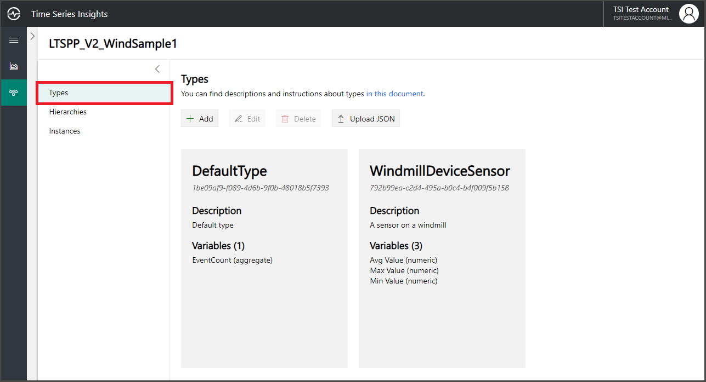](media/v2-update-how-to-tsm/portal_one.png#lightbox)

1. Select **Add**.
1. Input all details that pertain to types, and select **Create**. This action creates types in the environment.

    [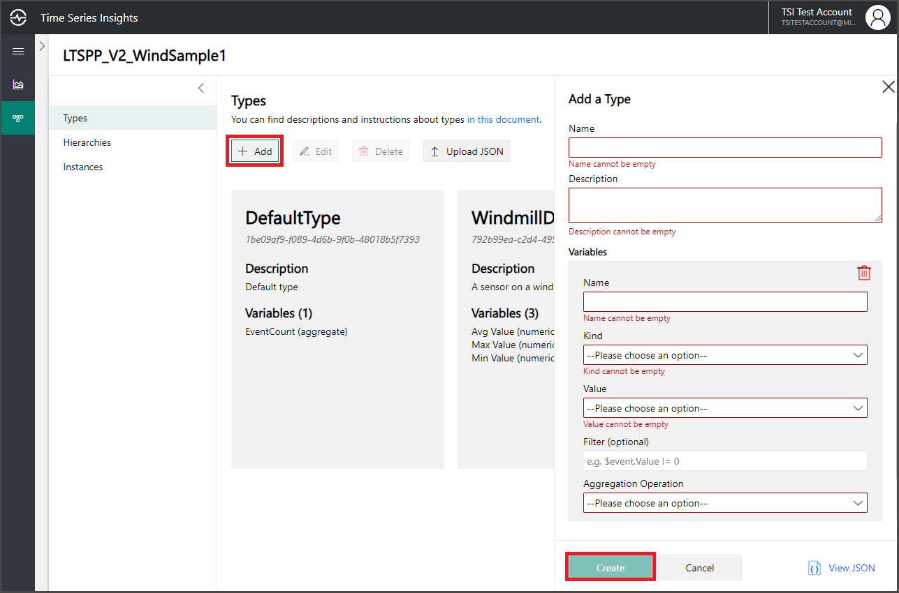](media/v2-update-how-to-tsm/portal_two.png#lightbox)

### Bulk upload one or more types

1. Select **Upload JSON**.
1. Select the file that contains the type payload.
1. Select **Upload**.

    [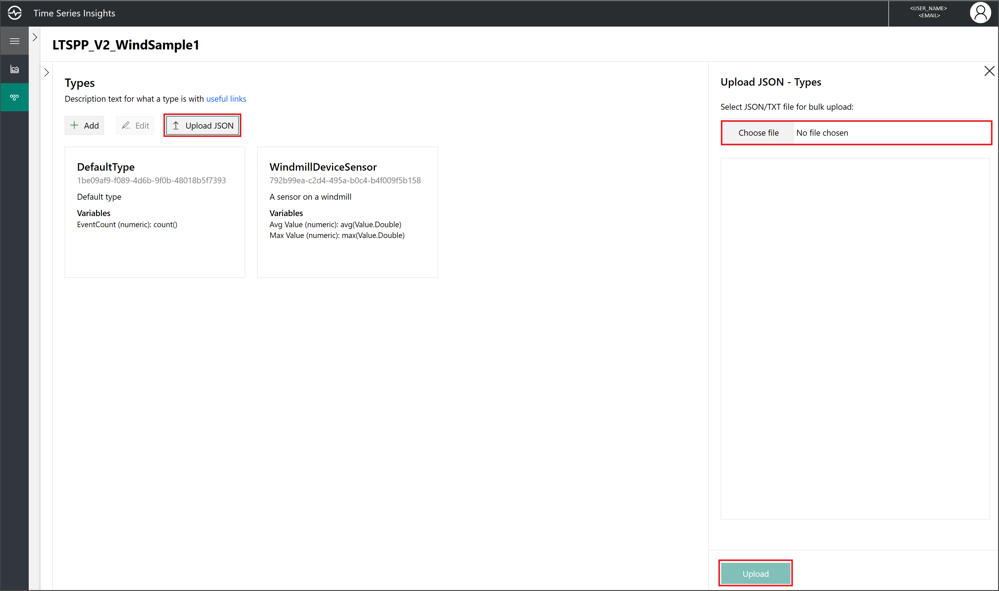](media/v2-update-how-to-tsm/portal_three.png#lightbox)

### Edit a single type

1. Select the type, and select **Edit**. 
1. Make the required changes, and select **Save**.

    [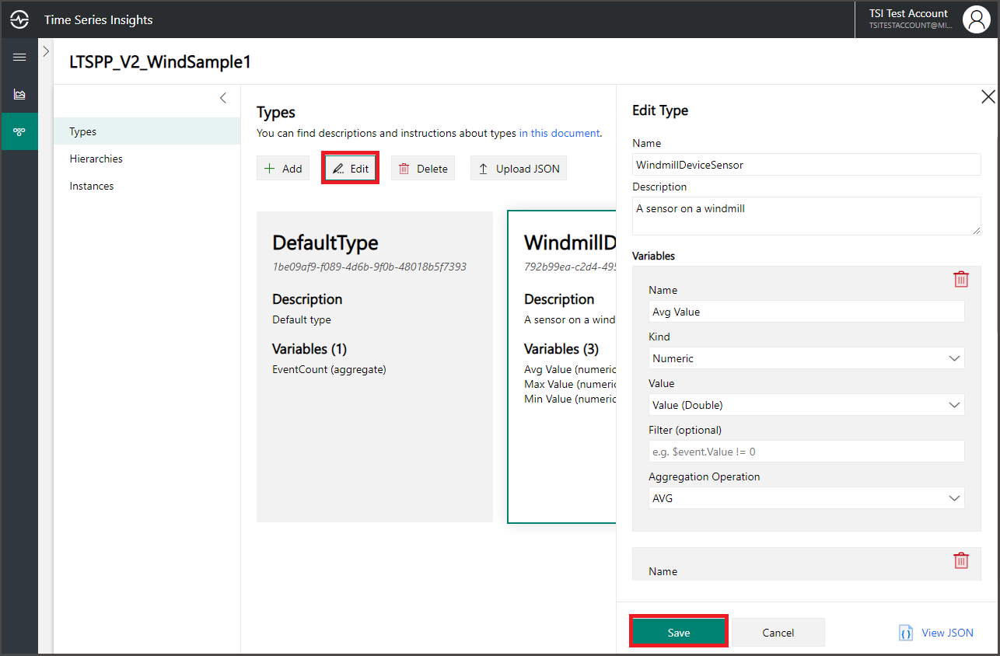](media/v2-update-how-to-tsm/portal_four.png#lightbox)

### Delete a type

1. Select the type, and select **Delete**.
1. If no instances are associated with the types, it's deleted.

    [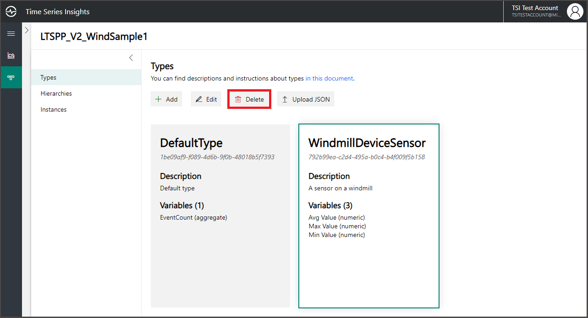](media/v2-update-how-to-tsm/portal_five.png#lightbox)

## Hierarchies

### Create a single hierarchy

1. Go to the Time Series Models selector panel, and select **Hierarchies** from the menu. Collapse the panel to focus on the Time Series Models hierarchies.

    [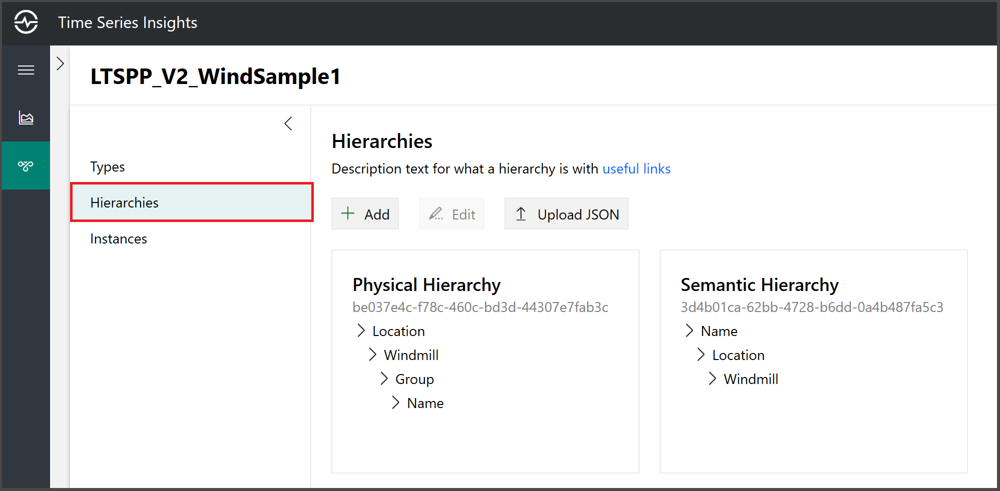](media/v2-update-how-to-tsm/portal_six.png#lightbox)

1. Select **Add**.

    [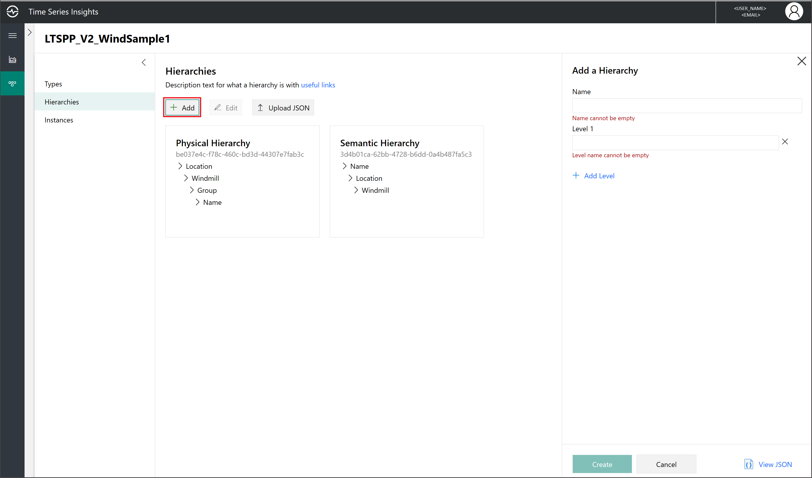](media/v2-update-how-to-tsm/portal_seven.png#lightbox)

1. Select **Add Level** in the right pane.

    [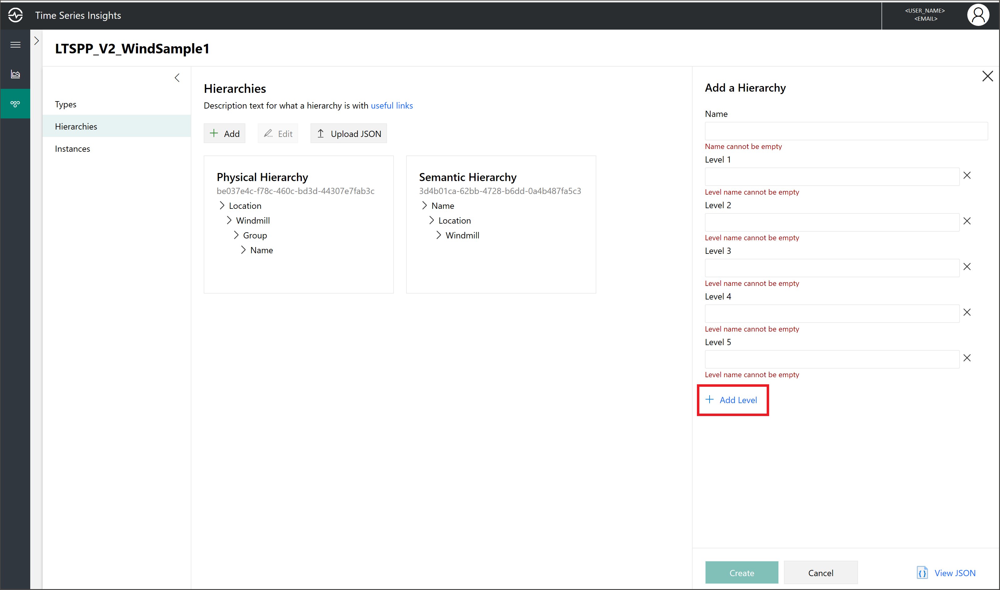](media/v2-update-how-to-tsm/portal_eight.png#lightbox)

1. Enter the hierarchy details, and select **Create**.

    [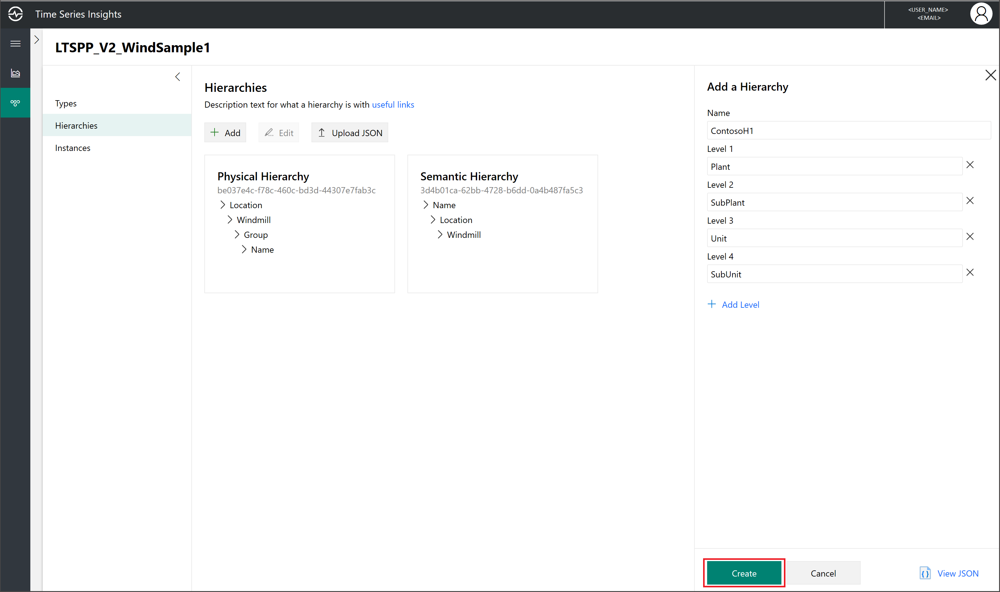](media/v2-update-how-to-tsm/portal_nine.png#lightbox)

### Bulk upload one or more hierarchies

1. Select **Upload JSON**.
1. Select the file that contains the hierarchy payload.
1. Select **Upload**.

    [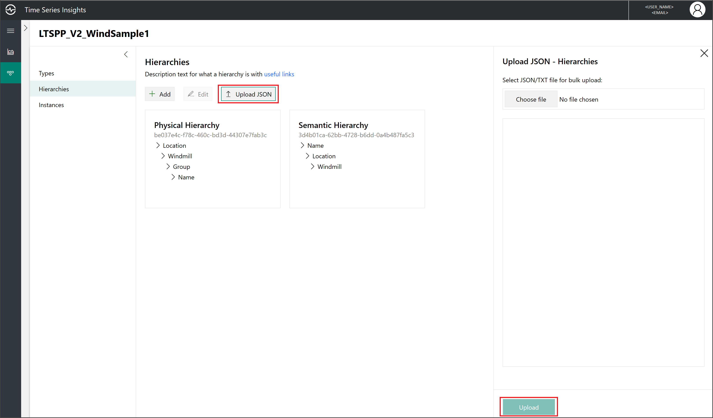](media/v2-update-how-to-tsm/portal_ten.png#lightbox)

### Edit a single hierarchy

1. Select the hierarchy, and select **Edit**.
1. Make the required changes, and select **Save**.

    

### Delete a hierarchy

1. Select the hierarchy, and Select **Delete**. 
1. If no instances are associated with the hierarchy, it's deleted.

    [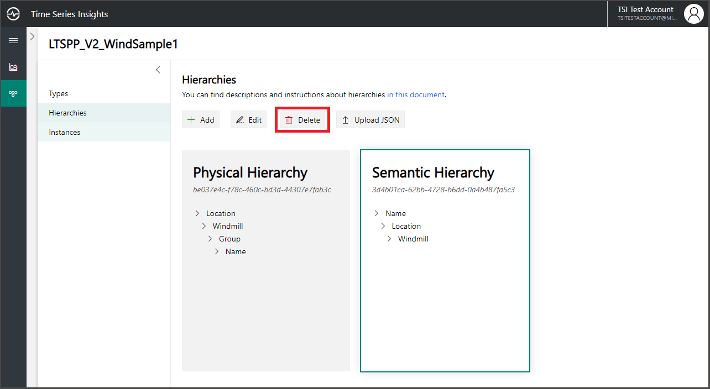](media/v2-update-how-to-tsm/portal_twelve.png#lightbox)

## Instances

### Create a single instance

1. Go to the Time Series Models selector panel, and select **Instances** from the menu. Collapse the panel to focus on the Time Series Models instances.

    [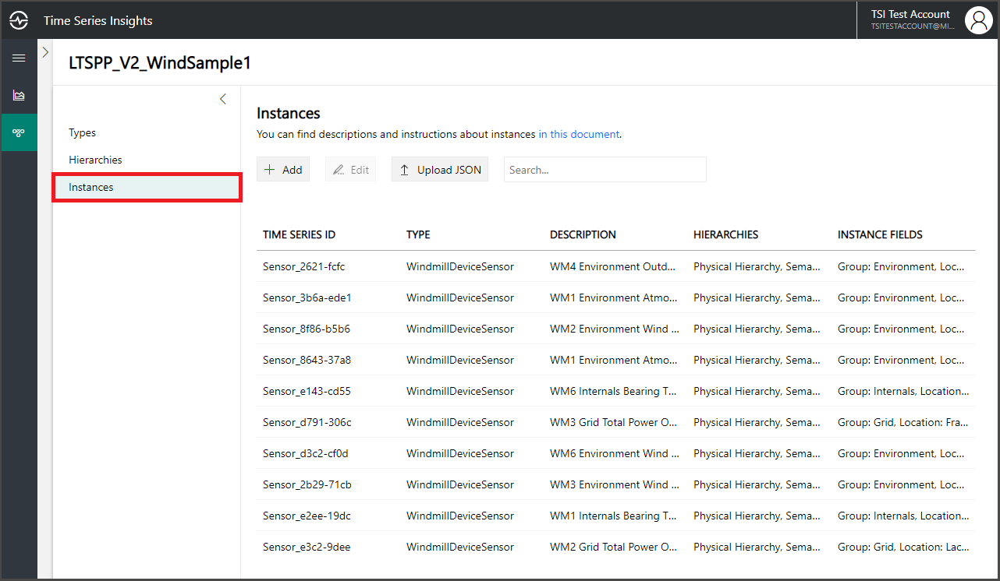](media/v2-update-how-to-tsm/portal_thirteen.png#lightbox)

1. Select **Add**.

    [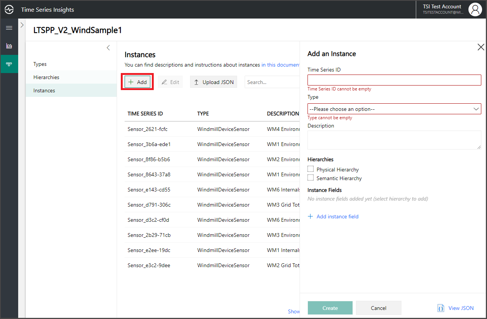](media/v2-update-how-to-tsm/portal_fourteen.png#lightbox)

1. Enter the instance details, select the type and hierarchy association, and select **Create**.

### Bulk upload one or more instances

1. Select **Upload JSON**.
1. Select the file that contains the instances payload.

    [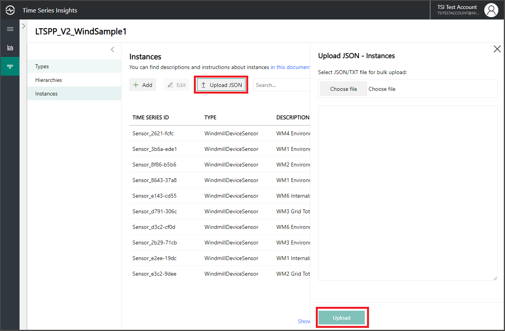](media/v2-update-how-to-tsm/portal_fifteen.png#lightbox)

1. Select **Upload**.

### Edit a single instance

1. Select the instance, and select **Edit**. 
1. Make the required changes, and select **Save**.

    [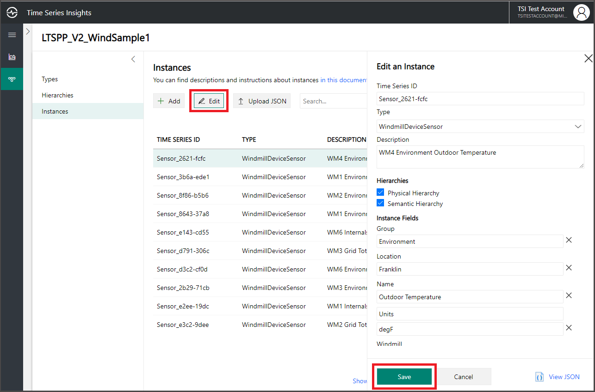](media/v2-update-how-to-tsm/portal_sixteen.png#lightbox)

## Next steps

- For more information about Time Series Models, read [Data modeling](./time-series-insights-update-tsm.md).

- To learn more about the preview, read [Visualize data in the Azure Time Series Insights Preview explorer](./time-series-insights-update-explorer.md).

- To learn about supported JSON shapes, read [Supported JSON Shapes](./time-series-insights-send-events.md#json).
